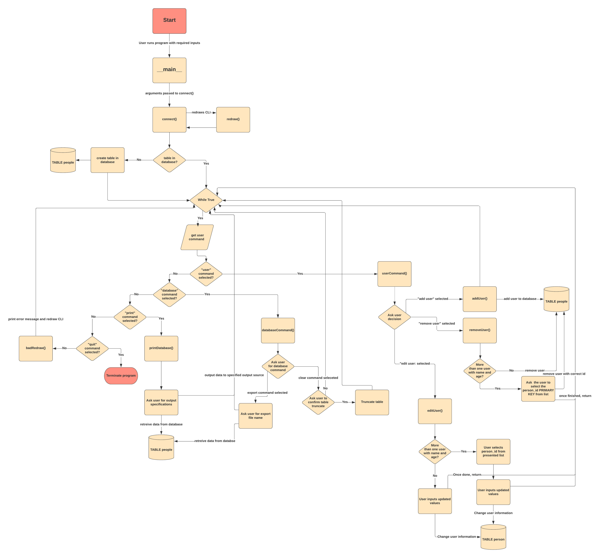
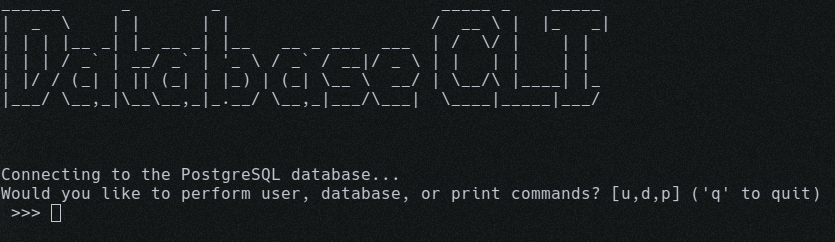

This is a program for one of the exercises that I had to do for one of my interviews

## Author: Zack Knight

## Challenge: Level 3

    1.Create a command-line based user interface program that:
        a.Accepts 3 command line parameters
            i. Required: name and age
            ii.Optional: phone number
        b.Stores the data in a database
        c.Supports the following commands:
            i.User:
                1.Add
                2.Remove
                3.Edit
            ii.Database:
                1.Export
                2.Clear
            iii.Print all users(in table format, sorted by 
                name, with all attributes) to stdout or a file

---

## Program Design

None of the design fundamentals I learned in my Software Engineering class </br> really showed how the program functioned in a way that I wanted. </br> The result is that I made my own version of a flow diagram. It is a </br>little packed, but it covers the entirety of how the program operates at a high level.



---

## Database table layout

The table that is being used has the label ***people***.  
It is set up like this:
| person_id | person_name | person_age | person_phone | time_created |
|:---------:|:-----------:|:----------:|:------------:|:---:|
| 1 | Test User | 50 | None | 2020-05-08 05:22:24.360292 | 

Where they were created with the following types:

- person_id = SERIAL PRIMARY KEY
- person_name = VARCHAR(255) NOT NULL
- person_age = INTEGER NOT NULL
- person_phone = VARCHAR(50)
- time_created = TIMESTAMP WITHOUT TIME ZONE DEFAULT (NOW() at time zone 'utc')

---

## Setting up for program execution

### Setting up PostgreSQL

I chose to use PostgreSQL, as that is what I figured would be the most likely to be used, and it was  
easy for me to set up. 

Please make sure that PostgreSQL is installed and then change what you need to in the ***database.ini*** file.

I use Linux when I program, so it was as easy as installing using my package manager and adding a new user.

You **do not** need to create a table in the database. The program will handle that for you.

### Setting up Python

The program was written in python 3.8, so I would reccomend using that version.  
If you do no have that version, I would at least make sure you have 3.7 installed.  

There are two ways to get the pip environemnt set up correctly.

1. Use pipenv (Reccomended)
2. Install using pip or a virtual environment 

#### Using pipenv (reccomended)

The way that I would reccomend to set up the python enviroment is to use pipenv.  
You can install it if you do not have it by using the command `pip install pipenv`.  
Make sure that you are using the python3 version of pip.

Once pipenv is installed you can then set up the pipenv. 

Run the command `pipenv install` and it should detect the Pipfile.lock  
file and install the correct versions of the required pip packages.

Once it is done, you can run `pipenv shell` and continue on to running the
program.

#### Using the regular pip or a virtual environment

I did not use this method when writing this program, so there is no guarantee that you will get the correct environemt set up.

That being said, I would reccoment using a virtual environment like venv over the system pip.

I will leave it up to you to install and set up the virtual environment.

Once it is actiavated or if you do not want to use one, you can run:

```
    pip install -r requirements.txt
```

I just hand copied the packages from the Pipfile, so it should work.

## Running the program

You should now be good to go after setting everything up.

You can see the help options with:
```
python level3.py -h
```

You must pass in the arguments for name and age. The phone number is optional.

An example run command is:

```
python level3.py -n "Test User" -a 50
```

You should then be presented with a screen like so:



The options are printed out before you.

- To perform user actions (add, remove, or edit the user): type `u` and hit enter.
- To perform database actions (export or clear the database): type `d` and hit enter.
- To perform a print command (Print to STDOUT, a text file, or csv file): type `p` and hit enter.
- To quit the progam, type `q` and hit enter
- If the input is not what the progam is expecting, you will get an error message and be sent </br>back to input your choice again.

If you are in an immediate submenu (You just entered `u`, `d`, or `p`), you can enter `back` to go back to the  
main menu and select another choice.

After completing a main menu action other than print, the CLI should redraw itself for a cleaner interface. 
